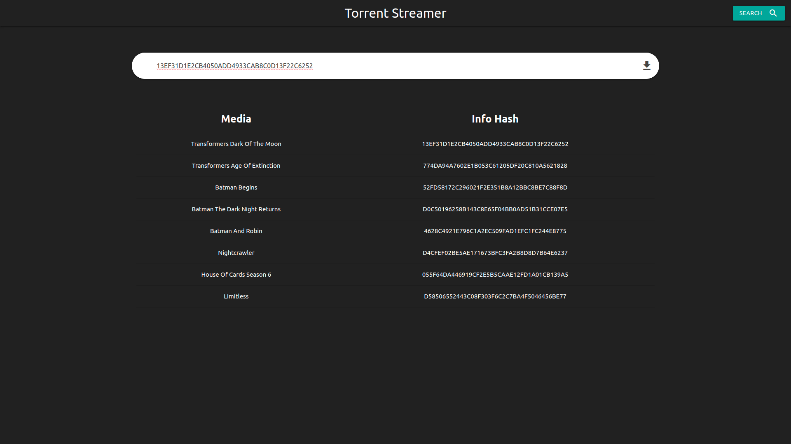
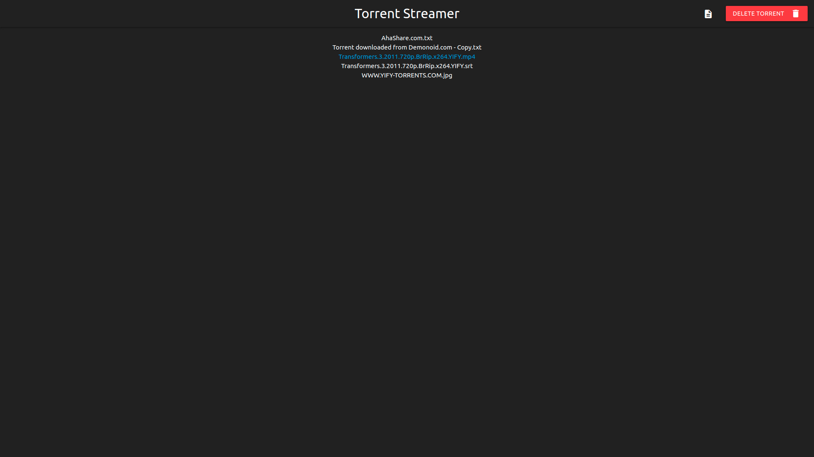
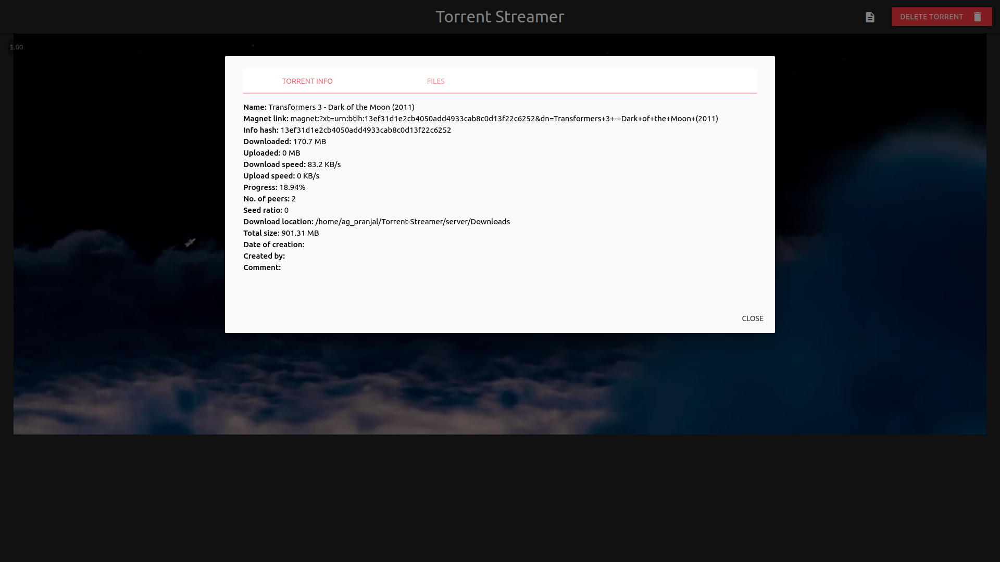

# Torrent-Streamer
Stream torrent media in the browser, while it downloads !

### Install node.js
`sudo apt install nodejs`

### Install npm
`sudo apt install npm`

### Install dependencies
Switch to Torrent-Streamer and type:
`npm install --prefix client && npm install --prefix server`

--- 

## For development
#### Start the server:
`npm start --prefix server`

#### Start the client (in another terminal):
`npm start --prefix client`

Visit [localhost:3000](http://127.0.0.1:3000) and start streaming !

---

## For production
Switch to Torrent-Streamer/

#### Build the react front-end
`npm run build`
#### Start the express server
`npm start --prefix server`

Visit [localhost:8000](http://127.0.0.1:8000) and start streaming !

---

## Screenshots

