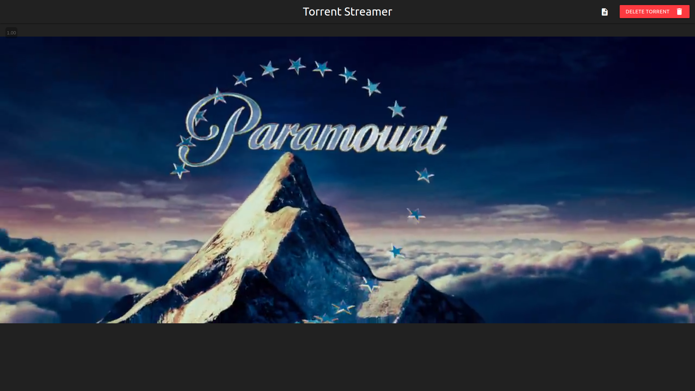

# Torrent-Streamer
Stream torrent media in the browser, while it downloads !

### Install nodejs
sudo apt install nodejs

### Install dependencies
Change current working directory to Torrent-Streamer and type the following:
+ `npm install`

### How to run ?
Start the server:
+ `cd server && npm start`

Start the client:
+ `cd ../client && npm start`

Visit [127.0.0.1:8000](http://127.0.0.1:8000) and start streaming !

---

## Screenshots

